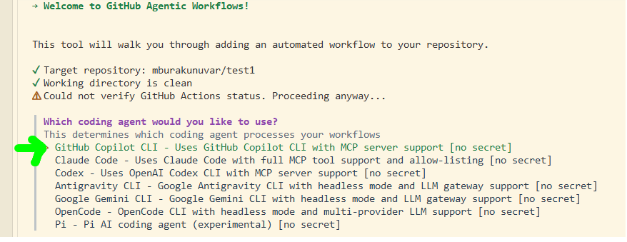
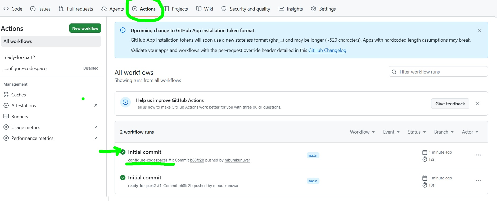

> [!IMPORTANT]  **DO NOT FORK OR CLONE THIS TEMPLATE REPOSITORY FOR THE EXERCISE!**
>
> Instead, create your own repository from the template. See
> [how to create a repository from a template](#1-create-your-workshop-repository).

> [!NOTE]
> **AFTER CREATING YOUR REPOSITORY FROM TEMPLATE, WAIT 20–30 SECONDS AND THEN REFRESH YOUR BROWSER**

> Because **configure-codespaces** workflow needs to be completed before continuing.
> This is required for the GitHub Codespace you'll create in the next step. The
> workflow updates `devcontainer.json` with the permissions required for your Codespace in this workshop.


# GitHub Agentic Workflows Workshop

Build and run secure, AI-powered automations with GitHub Agentic Workflows
(`gh-aw`). You will create workflows from natural-language prompts, install
pre-built workflows, and review their results in issues, pull requests, and
review comments.

## AGENDA : What Are We Going to Automate Today?

| # | Part | Outcome |
| :--: | --- | --- |
| 1 | [Create Your Workshop Repository](#1-create-your-workshop-repository) | Create an isolated repository from the workshop template |
| 2 | [Open the Repository in GitHub Codespaces](#2-open-the-repository-in-github-codespaces) | Configure and explore the development environment |
| 3 | [Install and Initialize `gh-aw`](#3-install-and-initialize-gh-aw) | Prepare the repository for Agentic Workflows |
| 4 | [Weekly Activity Report Workflow](#4-a-custom-agentic-workflow---weekly-activity-report) | Create a custom workflow that publishes a weekly report issue |
| 5 | [Code-Simplifier from GH Agentics](#5-install-prebaked-code-simplifier-from-gh-agentics) | Install a pre-built workflow that publishes daily status issues |
| 6 | [Create a Daily App Update Workflow](#6-create-a-daily-app-update-workflow) | Create a custom workflow that updates the web app |
| 7 | [Optional: Create a Daily FAQ Workflow](#7-optional-create-a-daily-faq-workflow) | Create a custom workflow that fetches and adds FAQ content |
| 8 | [Optional: Add the Grumpy Reviewer](#8-optional-add-the-grumpy-reviewer) | Install a pre-built workflow that reviews pull requests |


## 1. Create Your Workshop Repository

> [!IMPORTANT] 
> Do not fork or clone this repository. Create a repository 
> from the template so your work is isolated from other students.

1. Select **Use this template**, then **Create a new repository**.

   <p align="center">
      
   </p>

2. For **Owner**, select the organization provided by your instructor or use your personal repository. Enter a
   unique repository name, keep the default branch as `main`, and select
   **Create repository**.

   <p align="center">
      
   </p>

3. In the new repository, open **Settings > Actions > General** and confirm:

   - **Allow all actions and reusable workflows** is selected.
   - **Allow GitHub Actions to create and approve pull requests** is selected.

   Select **Save** if you changed either setting. If an organization policy
   prevents a change, contact your instructor.

> ⚠️ 
> [!CAUTION]
> This workshop uses your organization's **Copilot requests** billing. For
> Personal Access Token (PAT), see the [Appendix](appendix.md). If you proceed
> with PAT, never paste a real token into a comment, Markdown file, pull request,
> or Copilot Chat message. Only add it through the repository secrets UI.

## 2. Open the Repository in GitHub Codespaces

1. On the repository page, select **Code**, open the **Codespaces** tab, and
   select **Create codespace on main**. Keep the default settings.

   <p align="center">
      
   </p>

2. Wait for Visual Studio Code and the development container to finish loading.
   Initial setup may take a few minutes.

3. If Workspace Trust appears, trust the repository and continue.

   <p align="center">
      
   </p>

### Explore the Project

In Copilot Chat, try these prompts without asking Copilot to make changes:

```text
Briefly explain #codebase.
```

```text
Is agentic workflows installed in this repository? Do not take any action.
```

<p align="center">
   
</p>

To preview the sample site, right-click `index.html` and select
**Open with Live Server**.

<p align="center">
   
</p>

The sample application uses HTML, CSS, and JavaScript, but Agentic Workflows can
run in projects built with any language, framework, or runtime.

## 3. Install and Initialize `gh-aw`

Run the following commands in the Codespace terminal:

```bash
# Install the 'gh aw' extension
gh extension install github/gh-aw
# check version
gh aw version
```

> [!TIP]
> If `gh-aw` is already installed, replace the first command with
> `gh extension upgrade gh-aw`.

 
<!-- # OPTIONAL INCASE DEVCONTAINER FAILS - TROUBLESHOOTING  
```bash 
unset GH_TOKEN GITHUB_TOKEN
gh auth login --web --scopes repo,workflow
gh auth status
gh aw version
```

During `gh auth login`:

| Step | Where | Action |
| :--: | --- | --- |
| **1** | Terminal | Select **HTTPS** as the preferred Git protocol. |
| **2** | Terminal | Select **Yes** when asked to authenticate Git. |
| **3** | Terminal | Copy the one-time code, then press **Enter**. |
| **4** | Browser | Continue with your signed-in account and enter the code. |
| **5** | Browser | Select **Authorize GitHub CLI**. |
| **6** | Terminal | Wait for the successful authentication message. |

> [!NOTE]
> The `unset` command makes GitHub CLI use your browser-authenticated session
> instead of the restricted token injected by Codespaces. In every new
> terminal, run this command again before using `gh` or `gh aw`.

# OPTIONAL INCASE DEVCONTAINER FAILS - TROUBLESHOOTING   -->

Initialize Agentic Workflows, then commit the generated repository
configuration:

```bash
# initialize to build the gh-aw custom agent and the skill
gh aw init --engine copilot
# all the magic will happen in remote repo
git add .
git commit -m "initialize GitHub Agentic Workflows"
git push origin main
```

> [!NOTE]
> **Optional:** After this first push, the hand-written, deterministic
> **ready-for-part2** GitHub Actions workflow runs automatically. It archives
> sections 1–3, shortens this README for the rest of the workshop, and then
> disables itself. This example demonstrates that GitHub Actions and Agentic
> Workflows can coexist.
> If the run fails, open the **Actions** tab, select **ready-for-part2**, and
> choose **Run workflow** to retry it manually.

Then update your Codespace:

```bash
git pull --ff-only origin main
```

> [!TIP]
> If **Agentic Workflows Agent** does not appear in Copilot Chat, open the
> Command Palette and run **Developer: Reload Window**.


## 4. A custom agentic workflow - Weekly Activity Report 

> [!NOTE]
> **Status update: so far, so good.** 
> Don't forget to synch your local with remote. Hopefully now README is shorter clearer 😊🤞🍀

```bash
git pull --ff-only origin main
```

Let's build our first gh aw to track what's going on in our repository on a weekly basis


<p align="center">
   
</p>

1. In Copilot Chat, select the **Agentic Workflows Agent**.

2. Submit this prompt:

   ```text
   Create .github/workflows/weekly-report-status.md as an Agentic Workflow
   Markdown file.

   Requirements:
   - Use the Copilot engine.
   - Name the workflow Weekly Report Status.
   - Run on schedule every Monday and on demand with workflow_dispatch.
   - Grant contents: read, issues: read, pull-requests: read, and
     copilot-requests: write permissions.
   - Configure safe-outputs.create-issue with a title prefix of
     "[weekly-report] " and a maximum of one issue.
   - Generate a concise activity report for the previous seven days, covering
     commits, issues, and pull requests. Publish the report in a new issue and
     state clearly when no activity occurred.
   - Do not compile the workflow.
   ```

3. Review the generated Markdown, then validate, compile, commit, and run it:

   ```bash
   gh aw validate weekly-report-status
   gh aw compile .github/workflows/weekly-report-status.md
   git add . 
   git commit -m "added custom weekly report status workflow"
   git push origin main
   gh aw run weekly-report-status
   ```

4. Follow the run in the **Actions** tab. When it succeeds, open the
   **Issues** tab and review the new issue whose title starts with
   `[weekly-report]`.

> [!NOTE]
> Agentic workflow Markdown files (`.md`) are the source of truth. Their
> `.lock.yml` files are generated GitHub Actions workflows. Never edit a
> `.lock.yml` file manually; run
> `gh aw compile .github/workflows/FILENAME.md` after changing its Markdown
> source, then commit both files.

## 5. Install Prebaked Code-Simplifier from GH Agentics

[Agentics](https://github.com/githubnext/agentics) is an open-source collection
of GitHub Agentic Workflows that you can quickly install in your repositories.

Install the
[Code Simplifier](https://github.com/githubnext/agentics/blob/main/docs/code-simplifier.md) automatically analyze recently modified code and create pull requests with simplifications that improve clarity and maintainability

```bash
# Add the prebuilt workflow to your repository
gh aw add-wizard githubnext/agentics/code-simplifier
```

Use these selections when prompted:

| # | Prompt | Selection |
| :--: | --- | --- |
| 1 | Coding agent | **GitHub Copilot CLI** |
| 2 | Authentication | **Copilot requests** |
| 3 | Schedule | **Daily** |
| 4 | Create a setup pull request, if offered | **Yes** |
| 5 | Setup pull request action | **Attempt to merge** |

Selecting **Copilot requests** makes the wizard add
`copilot-requests: write` to the workflow automatically. No PAT or
`COPILOT_GITHUB_TOKEN` secret is required.

<table>
   <tr>
      <td width="50%" align="center">
         <a href="images/daily-p1.png"></a>
         <br><sub><strong>Coding agent: GitHub Copilot CLI</strong></sub>
      </td>
      <td width="50%" align="center">
         <a href="images/daily-p2.png"></a>
         <br><sub><strong>Authentication: Copilot requests</strong></sub>
      </td>
   </tr>
   <tr>
      <td width="50%" align="center">
         <a href="images/daily-p3.png"></a>
         <br><sub><strong>Schedule: Daily</strong></sub>
      </td>
      <td width="50%" align="center">
         <a href="images/daily-p5.png"></a>
         <br><sub><strong>Setup pull request: Attempt to merge</strong></sub>
      </td>
   </tr>
</table>

The wizard creates and compiles
`.github/workflows/code-simplifier.md` and opens a setup pull
request. It may also offer to merge the pull request and start the first run. 

After the setup pull request is merged, update your local default branch:

```bash
git pull --ff-only origin main
```

### Manually Editing Permissions

Add the following lines to the frontmatter of
`.github/workflows/code-simplifier.md`:

```yaml
permissions:
   actions: read
   attestations: read
   checks: read
   contents: read
   deployments: read
   discussions: read
   id-token: none
   issues: read
   packages: read
   pages: read
   pull-requests: read
   security-events: read
   statuses: read
   copilot-requests: write
```

### Compile Commit Push Again to enable updates:

```bash
gh aw compile .github/workflows/code-simplifier.md
git add .
git commit -m "added prebuilt aw Code-Simplifier" 
git push origin main
gh aw status
# run directly from the UI or
gh aw run code-simplifier
```

Open the repository's **Actions** tab to follow the run. When it succeeds, open
the **Issues** tab and find the new repository quality improvement report.

## 6. Create a Daily App Update Workflow

1. In Copilot Chat, select the **Agentic Workflows Agent**.

2. Submit this prompt:

   ```text
   Create .github/workflows/new-day.md as an Agentic Workflow Markdown file.

   Requirements:
   - Use the Copilot engine.
   - Run once per day and on demand with workflow_dispatch.
   - Grant contents: read and copilot-requests: write permissions.
   - Enable file editing with tools.edit.
   - Configure safe-outputs.create-pull-request with index.html as the only
     allowed file and a maximum of one pull request.
   - Use the workflow run's UTC date.
   - In index.html, add that date to the existing Daily Updates navigation and
     add a matching accessible dialog that confirms the daily update ran.
   - Follow the existing HTML structure, ID conventions, date wording, and
     styling. Do not modify styles.css.
   - Do not duplicate a date, navigation control, or dialog. If the UTC date is
     already present, make no change.
   - Preserve every existing daily update.
   - Validate the workflow with gh aw validate new-day.
   - Do not compile the workflow.
   ```

3. Review the generated Markdown, then validate, compile, commit, and run it:

   ```bash
   gh aw validate new-day
   gh aw compile .github/workflows/new-day.md
   git add .
   git commit -m "added daily website update workflow"
   git push origin main
   gh aw run new-day
   ```

4. Follow the run in the **Actions** tab. Review and merge the pull request it
   creates, then update your Codespace without creating a merge commit:

   ```bash
   git pull --ff-only origin main
   ```

   Complete this step before creating the next workflow so both workflows start
   from the same version of `index.html`.

## 7. Optional: Create a Daily FAQ Workflow

1. In Copilot Chat, keep **Agentic Workflows Agent** selected.

2. Submit this prompt:

   ```text
   Create .github/workflows/highlights-of-day.md as an Agentic Workflow Markdown
   file.

   Requirements:
   - Use the Copilot engine.
   - Run every six hours and on demand with workflow_dispatch.
   - Grant contents: read and copilot-requests: write permissions.
   - Enable tools.edit and tools.web-fetch.
   - Configure network.allowed with github.github.com.
   - Fetch the GitHub Agentic Workflows FAQ:
     https://github.github.com/gh-aw/reference/faq/
   - Select one FAQ that is not already represented in index.html.
   - Use the workflow run's UTC date.
   - Add the selected question and a concise, accurate answer to the matching
     Daily Updates dialog in index.html. If that date already has a placeholder
     dialog, reuse it; otherwise add a matching navigation control and dialog.
   - Match the existing HTML structure, ID conventions, date wording, and
     styling. Preserve all existing updates.
   - Never duplicate a date, navigation control, dialog, or FAQ. If today's
     dialog already contains an FAQ, or no unused FAQ remains, make no change.
   - Configure safe-outputs.create-pull-request with index.html as the only
     allowed file and a maximum of one pull request.
   - Validate the workflow with gh aw validate highlights-of-day.
   - Do not compile the workflow.
   ```

3. Review the generated Markdown, then validate, compile, commit, and run it:

   ```bash
   gh aw validate highlights-of-day
   gh aw compile .github/workflows/highlights-of-day.md
   git add . 
   git commit -m "fetched and added highlights of the day"
   git push origin main
   gh aw run highlights-of-day
   ```

4. Follow the run in the **Actions** tab, then review and merge its pull
   request. A later run on the same UTC day should not create a duplicate
   update.

> [!NOTE]
> **What is a safe output?**
>
> A safe output is a controlled GitHub write operation declared under
> `safe-outputs:`. The agent remains read-only and requests a narrowly configured
> operation that a separate, permission-controlled job validates and performs.
>
> | Safe output | What it can do | Example use |
> | --- | --- | --- |
> | `create-issue` | Open a new issue | Report a test-quality gap |
> | `add-comment` | Comment on an issue or pull request | Review changed tests |
> | `create-pull-request` | Propose file changes in a pull request | Update stale documentation |
> | `add-labels` | Add allowed labels | Triage incoming issues |
>
> `noop` is always available. Use it when the workflow succeeds but finds
> nothing useful to change.
>
> #### Configuration Examples
>
> **Create an issue:**
>
> ```yaml
> safe-outputs:
>   create-issue:
>     title-prefix: "[quality] "
>     max: 1
> ```
>
> **Create a pull request:**
>
> ```yaml
> safe-outputs:
>   create-pull-request:
>     draft: true
>     allowed-files:
>       - "**/*.md"
>     max: 1
> ```

## 8. Optional: Add the Grumpy Reviewer

The
[Grumpy Reviewer](https://github.com/githubnext/agentics/blob/main/docs/grumpy-reviewer.md)
is an on-demand workflow that reviews changed lines in a pull request and posts
up to five focused comments.

Install it from a clean working tree:

```bash
gh aw add-wizard githubnext/agentics/grumpy-reviewer
```

Choose **GitHub Copilot CLI**, **Copilot requests**, and **Attempt to merge**
when prompted. After the setup pull request is merged, open any pull request
and add one of these comments:

```text
/grumpy
```

```text
/grumpy focus on security
```

```text
/grumpy check error handling especially
```

## Troubleshooting

| Problem | Resolution |
| --- | --- |
| `gh` uses the restricted Codespaces token | Run `unset GH_TOKEN GITHUB_TOKEN` in the current terminal. |
| `add-wizard` reports a dirty working tree | Commit the intended changes before rerunning the wizard. |
| Copilot requests is unavailable or returns `403` | Confirm the repository belongs to the instructor's organization, then contact the instructor to verify Copilot billing. |
| A workflow is missing or its lock file is stale | Run `git pull --ff-only origin main`, then `gh aw compile .github/workflows/FILENAME.md` and commit both workflow files. |
| A workflow cannot create a pull request | Recheck **Settings > Actions > General**, or ask the instructor whether an organization policy blocks pull request creation. |

## References

- [GitHub Agentic Workflows documentation](https://github.github.com/gh-aw/)
- [GH-AW-WORKSHOP](https://githubnext.github.io/gh-aw-workshop/#00-welcome)
- [`gh-aw` CLI reference](https://github.github.com/gh-aw/setup/cli/)
- [Workflow permissions](https://github.github.com/gh-aw/reference/permissions/)
- [Safe outputs](https://github.github.com/gh-aw/reference/safe-outputs/)

## Appendix

### How to Check the Initial Workflow Status

After creating your repository from the template:

1. Open the repository's **Actions** tab.
2. Find the **configure-codespaces** run named **Initial commit**.
3. Wait for the run to display a green check mark before creating your
   Codespace. After a successful run, **configure-codespaces** appears as
   **Disabled** because it is a one-time setup workflow.

<p align="center">
   
</p>

For personal-repository setup instructions, see the [Appendix](appendix.md).
