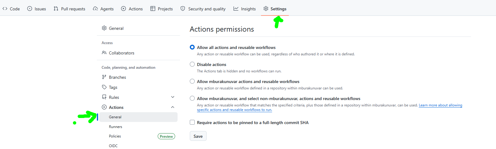

## APPENDIX


### Quick Start in your own environment

Reference: [GitHub Agentic Workflows quick start](https://github.github.com/gh-aw/setup/quick-start/)

#### Prerequisites

Before installing, ensure you have:

- **AI account** - GitHub Copilot, Anthropic Claude, OpenAI Codex, or Google Gemini. If you already have GitHub Copilot, start there—it requires no extra account setup.
- **GitHub repository** - A repository where you have write access.
- **GitHub Actions enabled** - Check in **Settings** → **Actions**.
- **GitHub CLI (`gh`) v2.0.0+** - [Install GitHub CLI](https://cli.github.com/). Check your version with `gh --version`.
- **Logged in to GitHub CLI** - Verify with `gh auth status`, and run `gh auth login --scopes repo,workflow` if needed.
- **Operating system** - Linux, macOS, or Windows with WSL.

#### Step 1 - Install the extension

Install the GitHub Agentic Workflows extension:

```bash
gh extension install github/gh-aw
```

> [!TIP]
> If you encounter authentication issues, use the installation script instead:
>
> ```bash
> curl -sL https://raw.githubusercontent.com/github/gh-aw/main/install-gh-aw.sh | bash
> ```
>
> Or log in interactively:
>
> ```bash
> gh auth login
> ```

### Copilot Authentication for GitHub Agentic Workflows

Agentic workflows using the Copilot engine must authenticate Copilot inference. Choose one of these methods:

| Method | Use when | Credential and billing |
|---|---|---|
| `copilot-requests: write` | The workflow runs in an organization repository with Copilot CLI organization billing enabled | Uses the run-scoped `GITHUB_TOKEN`; usage is billed to the organization |
| `COPILOT_GITHUB_TOKEN` | The workflow runs in a personal repository, or organization billing is unavailable | Uses a user-owned fine-grained PAT; usage depends on that user's Copilot access |

**Prefer `copilot-requests: write` when it is available.** It avoids storing and rotating a long-lived secret:

```yaml
---
permissions:
  contents: read
  copilot-requests: write
---
```

After changing workflow frontmatter, run `gh aw compile` and commit the regenerated lock file. Organization owners must also allow Copilot CLI usage billed to the organization. Upgrade an older Agentic Workflows extension with:

```bash
gh extension upgrade aw
```

Use a PAT only as the fallback. The token must:

- Be a **fine-grained personal access token** owned by a user, not an organization.
- Have **Account permissions > Copilot Requests: Read**.
- Belong to an account with Copilot inference access.
- Be stored as the Actions secret `COPILOT_GITHUB_TOKEN`, never in workflow source.

If `copilot-requests: write` is present, gh-aw ignores `COPILOT_GITHUB_TOKEN` and `GH_AW_GITHUB_TOKEN` for inference. Remove the permission and recompile before switching to PAT authentication. OAuth user tokens (`gho_...`) are not supported.

These settings authenticate **Copilot inference only**. Repository access for GitHub API operations is separate:

- `GITHUB_TOKEN` supplies the workflow's normal, run-scoped GitHub permissions.
- `GH_AW_GITHUB_TOKEN` can provide additional GitHub API access when the default token is insufficient; it does not replace `COPILOT_GITHUB_TOKEN` for inference.
- Codespaces permissions in `.devcontainer/devcontainer.json` apply to commands run from the Codespace, not to Copilot inference in GitHub Actions.

Repository-wide **Read and write permissions** are not required merely to authenticate Copilot. Grant only the workflow and safe-output permissions needed by the exercise.

### Creating a Personal Access Token (PAT) for Personal Repositories

1. Set up the `COPILOT_GITHUB_TOKEN` repository secret that the Copilot engine will use later in the exercise.

   1. [Create a fine-grained personal access token](https://github.com/settings/personal-access-tokens/new?name=COPILOT_GITHUB_TOKEN&description=GitHub+Agentic+Workflows+-+Copilot+engine+authentication&user_copilot_requests=read) with **Copilot Requests** set to **Read**.
      <details>
        <summary>Token permissions details</summary><br/>
        
        
      </details>
   2. Copy the token value.
   3. In your copied exercise repository, go to **Settings** > **Secrets and variables** > **Actions**.
   4. Select **New repository secret**.
   5. Name the secret `COPILOT_GITHUB_TOKEN`, paste the token value, and save it.
      <details>
        <summary>Repository Action secrets details</summary><br/>

        
        
        
      </details>

> [!CAUTION]
> Never paste a real token into a comment, markdown file, pull request, or Copilot Chat message. Only add it through the repository secrets UI.

2. Set the Actions workflow permissions to **Read and write permissions** so the agent can propose changes to the website content.

   1. In your copied exercise repository, go to **Settings** > **Actions** > **General**.
   2. Under **Workflow permissions**, select **Read and write permissions**.
   3. Check **Allow GitHub Actions to create and approve pull requests**.
   4. Save the changes.

   <details>
     <summary>Actions workflow permissions details</summary><br/>

     

  </details>


     <p align="center">
     
     </p>


## The two axes at a glance

Copilot auth and the **Workflow permissions** setting (Settings → Actions → General) point in opposite directions. They are never substitutes for each other.

```text
                    ┌─────────────────────┐
   Copilot API  ◄───┤                     ├───►  GitHub repo
   (inference)      │  Agentic workflow   │      (issues, PRs, code)
                    │  running in Actions │
                    └─────────────────────┘
        ▲                                              ▲
        │                                              │
  copilot-requests: write                    Workflow permissions
  or COPILOT_GITHUB_TOKEN                    (org/repo settings page)
                                             + permissions: frontmatter

  "Can the agent THINK?"                     "Can the agent WRITE?"
```

| | Copilot auth | Workflow permissions |
|---|---|---|
| Direction | **Outbound** — Actions → Copilot API | **Inbound** — Actions → GitHub repo |
| Question | Can it do AI reasoning? | Can it read/change repo content? |
| Configured in | Workflow frontmatter, or a repo secret | Org/repo Actions settings + `permissions:` frontmatter |
| Failure symptom | `401` at the inference step | `403 Resource not accessible by integration` |
| Costs money | Yes — Copilot billing | No |


## Resources
- [Agentic workflows no longer need a personal access token](https://github.blog/changelog/2026-06-11-agentic-workflows-no-longer-need-a-personal-access-token/)
