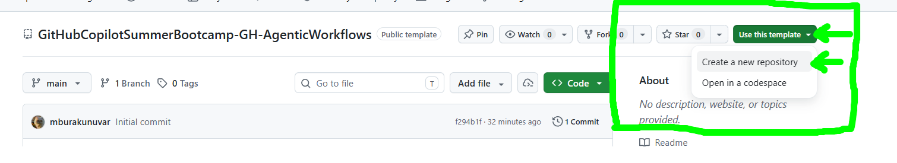
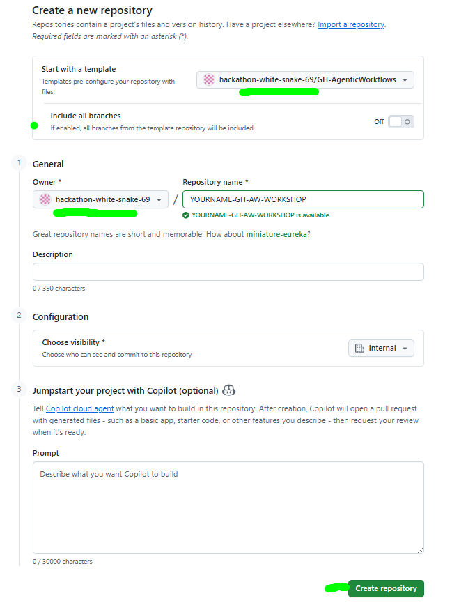
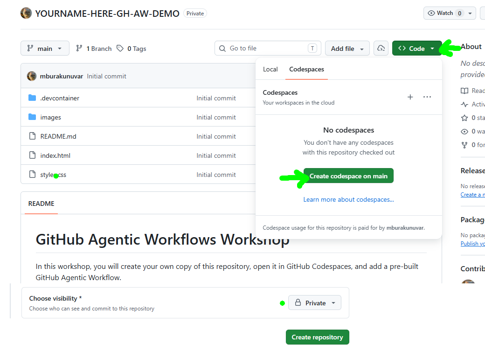
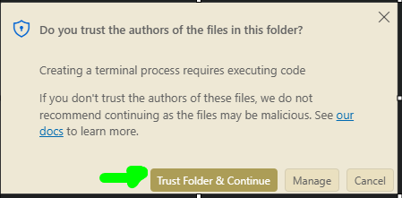
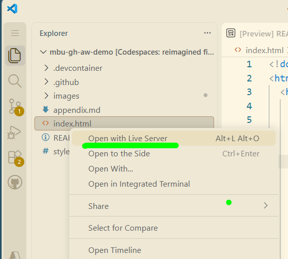

# GitHub Agentic Workflows Workshop

Build and run secure, AI-powered automations with GitHub Agentic Workflows
(`gh-aw`). You will create workflows from natural-language prompts, install
pre-built workflows, and review their results in issues, pull requests, and
review comments.

## AGENDA : What Are We Going to Automate Today?

| # | Part | Outcome |
| :--: | --- | --- |
| 1 | [Create Your Workshop Repository](#1-create-your-workshop-repository) | Create an isolated repository from the workshop template |
| 2 | [Open the Repository in GitHub Codespaces](#2-open-the-repository-in-github-codespaces) | Configure and explore the development environment |
| 3 | [Install and Initialize `gh-aw`](#3-install-and-initialize-gh-aw) | Prepare the repository for Agentic Workflows |
| 4 | [Weekly Activity Report Workflow](#4-a-custom-agentic-workflow---weekly-activity-report) | Create a custom workflow that publishes a weekly report issue |
| 5 | [Code-Simplifier from GH Agentics](#5-install-prebaked-code-simplifier-from-gh-agentics) | Install a pre-built workflow that publishes daily status issues |
| 6 | [Create a Daily App Update Workflow](#6-create-a-daily-app-update-workflow) | Create a custom workflow that updates the web app |
| 7 | [Optional: Create a Daily FAQ Workflow](#7-optional-create-a-daily-faq-workflow) | Create a custom workflow that fetches and adds FAQ content |
| 8 | [Optional: Add the Grumpy Reviewer](#8-optional-add-the-grumpy-reviewer) | Install a pre-built workflow that reviews pull requests |


## 1. Create Your Workshop Repository

> [!IMPORTANT] 
> Do not fork or clone this repository. Create a repository 
> from the template so your work is isolated from other students.

1. Select **Use this template**, then **Create a new repository**.

   <p align="center">
      
   </p>

2. For **Owner**, select the organization provided by your instructor or use your personal repository. Enter a
   unique repository name, keep the default branch as `main`, and select
   **Create repository**.

   <p align="center">
      
   </p>

3. In the new repository, open **Settings > Actions > General** and confirm:

   - **Allow all actions and reusable workflows** is selected.
   - **Allow GitHub Actions to create and approve pull requests** is selected.

   Select **Save** if you changed either setting. If an organization policy
   prevents a change, contact your instructor.

> ⚠️ 
> [!CAUTION]
> This workshop uses your organization's **Copilot requests** billing. For
> Personal Access Token (PAT), see the [Appendix](appendix.md). If you proceed
> with PAT, never paste a real token into a comment, Markdown file, pull request,
> or Copilot Chat message. Only add it through the repository secrets UI.

## 2. Open the Repository in GitHub Codespaces

1. On the repository page, select **Code**, open the **Codespaces** tab, and
   select **Create codespace on main**. Keep the default settings.

   <p align="center">
      
   </p>

2. Wait for Visual Studio Code and the development container to finish loading.
   Initial setup may take a few minutes.

3. If Workspace Trust appears, trust the repository and continue.

   <p align="center">
      
   </p>

### Explore the Project

In Copilot Chat, try these prompts without asking Copilot to make changes:

```text
Briefly explain #codebase.
```

```text
Is agentic workflows installed in this repository? Do not take any action.
```

<p align="center">
   
</p>

To preview the sample site, right-click `index.html` and select
**Open with Live Server**.

<p align="center">
   
</p>

The sample application uses HTML, CSS, and JavaScript, but Agentic Workflows can
run in projects built with any language, framework, or runtime.

## 3. Install and Initialize `gh-aw`

Run the following commands in the Codespace terminal:

```bash
# Install the 'gh aw' extension
gh extension install github/gh-aw
# check version
gh aw version
```

> [!TIP]
> If `gh-aw` is already installed, replace the first command with
> `gh extension upgrade gh-aw`.

 
<!-- # OPTIONAL INCASE DEVCONTAINER FAILS - TROUBLESHOOTING  
```bash 
unset GH_TOKEN GITHUB_TOKEN
gh auth login --web --scopes repo,workflow
gh auth status
gh aw version
```

During `gh auth login`:

| Step | Where | Action |
| :--: | --- | --- |
| **1** | Terminal | Select **HTTPS** as the preferred Git protocol. |
| **2** | Terminal | Select **Yes** when asked to authenticate Git. |
| **3** | Terminal | Copy the one-time code, then press **Enter**. |
| **4** | Browser | Continue with your signed-in account and enter the code. |
| **5** | Browser | Select **Authorize GitHub CLI**. |
| **6** | Terminal | Wait for the successful authentication message. |

> [!NOTE]
> The `unset` command makes GitHub CLI use your browser-authenticated session
> instead of the restricted token injected by Codespaces. In every new
> terminal, run this command again before using `gh` or `gh aw`.

# OPTIONAL INCASE DEVCONTAINER FAILS - TROUBLESHOOTING   -->

Initialize Agentic Workflows, then commit the generated repository
configuration:

```bash
# initialize to build the gh-aw custom agent and the skill
gh aw init --engine copilot
# all the magic will happen in remote repo
git add .
git commit -m "initialize GitHub Agentic Workflows"
git push origin main
```

> [!NOTE]
> **Optional:** After this first push, the hand-written, deterministic
> **ready-for-part2** GitHub Actions workflow runs automatically. It archives
> sections 1–3, shortens this README for the rest of the workshop, and then
> disables itself. This example demonstrates that GitHub Actions and Agentic
> Workflows can coexist.
> If the run fails, open the **Actions** tab, select **ready-for-part2**, and
> choose **Run workflow** to retry it manually.

Then update your Codespace:

```bash
git pull --ff-only origin main
```

> [!TIP]
> If **Agentic Workflows Agent** does not appear in Copilot Chat, open the
> Command Palette and run **Developer: Reload Window**.


